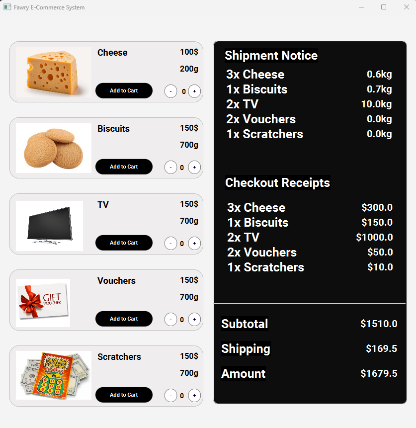
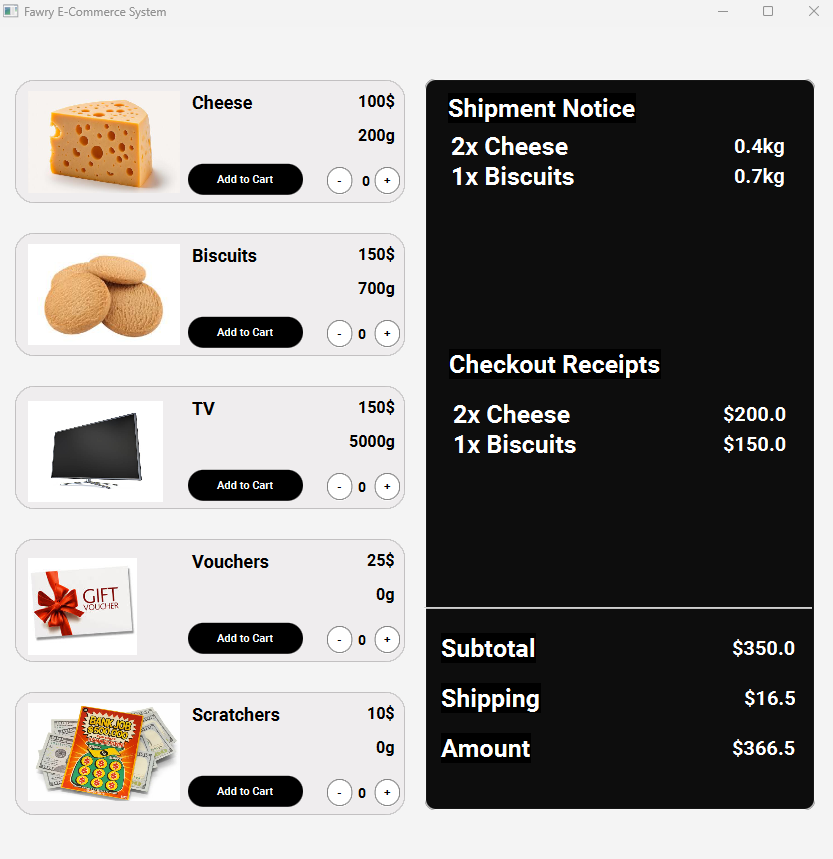
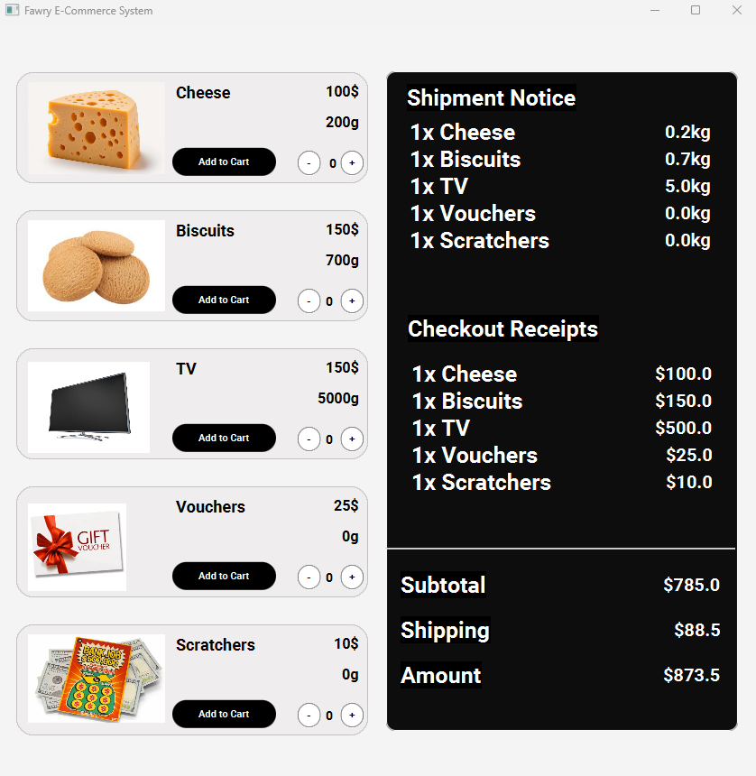
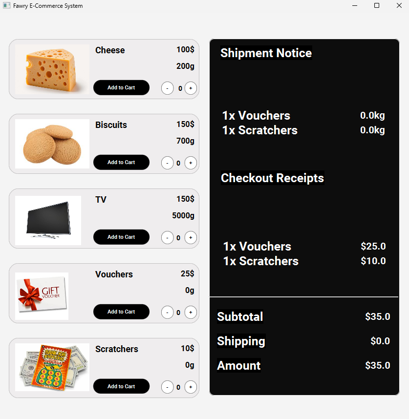
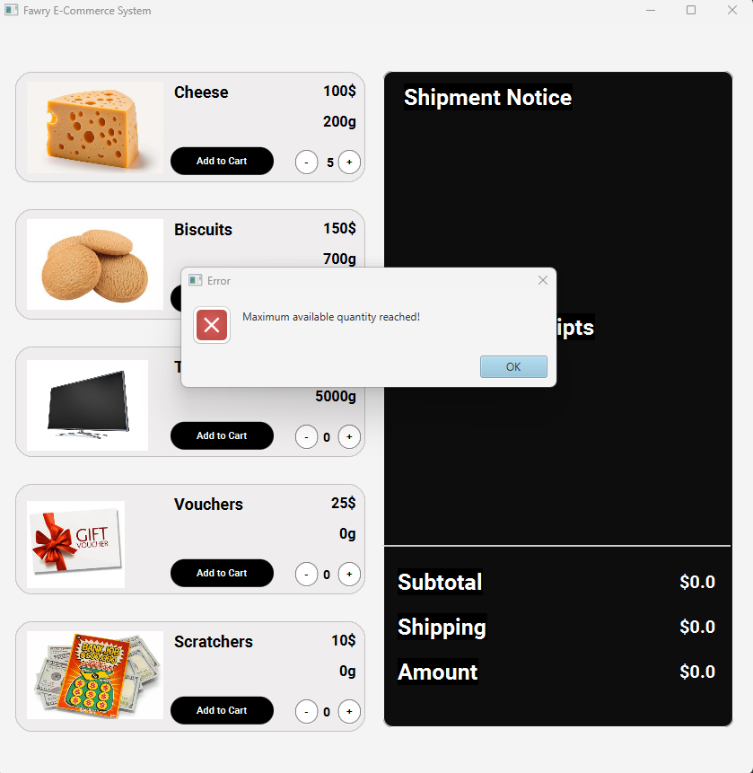
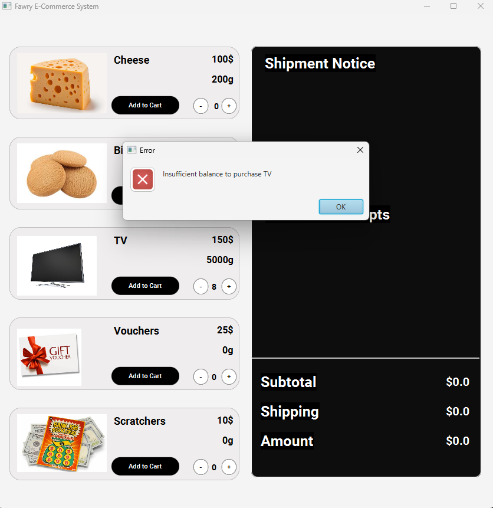
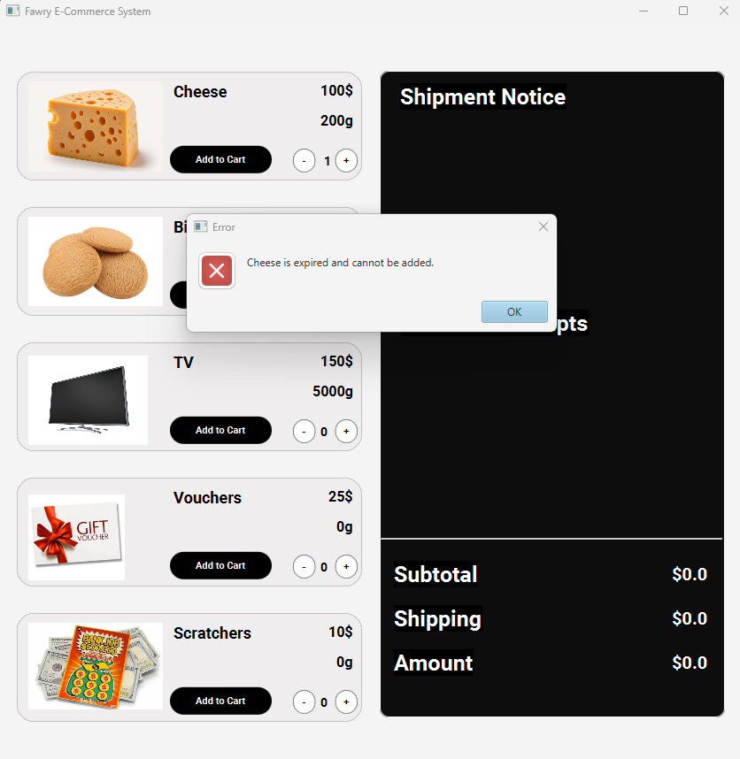

# Fawry-ECommerce-System
Object-Oriented E-Commerce Simulation built using Java, JavaFX, and CSS for the Fawry Rise Journey – Full Stack Development Internship Challenge.

# Products Included
I included five products to cover all the possibilities according to those two questions included
1) Is It Shippable?
2) Does It Have an Expiration Date?

## For those I included five products
1. Cheese and Biscuits (Shippable, Has Expiration Date)
2. TV (Shippable, No Expiration Date)
3. Vouchers (Not Shippable, No Expiration Date)
4. Scratchers (Not Shippable, Has Expiration Date)

# OOP Principles Used
The following object-oriented principles were utilized:

1. `Abstract Classes` – For defining base `product` behavior. 
2. `Inheritance` – Specialized classes like `ExpirableProduct` and `NonExpirableProduct` extend from a base product class. 
3. `Interfaces` – Shippable interface is used for items requiring shipping services.

# Test Cases
## Test Case 1: Valid checkout with only shippable + Expirable items

## Test Case 2: Checkout with all types of products

## Test Case 3: Checkout with only non-shippable items

## Test Case 4: Quantity exceeds available stock
`cheese` has 5 maximum products.

## Test Case 5: Customer balance insufficient
`balance` is set to 1000.

## Test Case 6: Product expired (force expiry)
For this test case, change `products.put("Cheese", new ExpirableProduct("Cheese", 100, 5, true, 0.2, LocalDate.now().plusDays(7)));` to `products.put("Cheese", new ExpirableProduct("Cheese", 100, 5, true, 0.2, LocalDate.now().minusDays(1)));`

